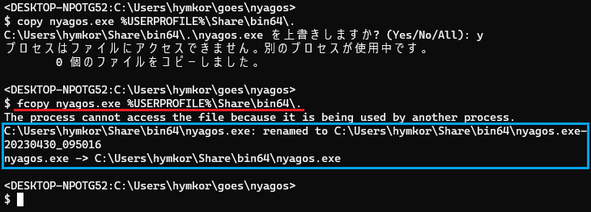

FCOPY
=====

`fcopy` copies files even if they are using by other processes and/or the destination directories are write-protected by not administrators.



```
fcopy SRC... DST
```

If `fcopy` fails to copy the first time, it tries again with these method

* ERROR: `The process cannot access the file because it is being used by another process.`
    * If `DST` is used by another process, `fcopy` tries to rename busy `DST` to `DST-YYYYMMDD_hhmmss` and retry copying.
* ERROR: `Access is denied.`
    * If `DST` is the directory which not-administrator can not write (for example, `C:\Program Files`) , `fcopy` tries to show User-Account-Control dialog and run itself as Administrator.

Install
-------

Download the binary package from [Releases](https://github.com/hymkor/fcopy/releases) and extract the executable.

### for scoop-installer

```
scoop install https://raw.githubusercontent.com/hymkor/fcopy/master/fcopy.json
```

or

```
scoop bucket add hymkor https://github.com/hymkor/scoop-bucket
scoop install fcopy
```

Release Notes
-------------

### 0.2.0

- Fix: fail when the destinate ends with backslash.
- Do not copy if the destinate file is same as source one.

### 0.1.0

- first release.
